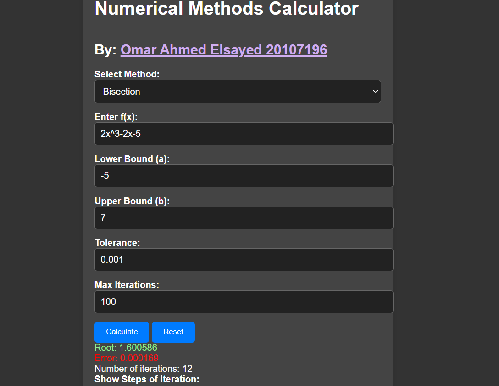

# Numerical Methods Calculator Web App

## Overview

The Numerical Methods Calculator is a web application that allows users to apply various numerical methods to find the roots of mathematical functions. The calculator provides five different root-finding methods: Bisection, False Position, Secant, Newton-Raphson, and Simple Fixed-Point Iteration.

The project is implemented in JavaScript and provides a user-friendly interface for entering function expressions, specifying method parameters, and viewing the results. It also includes features such as displaying the steps of the iteration and plotting the methods.

## Features

- Five root-finding methods:
  1. Bisection
  2. False Position
  3. Secant
  4. Newton-Raphson
  5. Simple Fixed-Point Iteration

- User-friendly input for:
  - Mathematical function expression (e.g., "2x^2 + 3x + 12")
  - Method-specific parameters (e.g., tolerance, max iterations)

- Display of root and error estimates.

- Option to display steps of the iteration.

- Option to plot the method (requires additional dependencies).

## Getting Started

Find the Calculator At [this link](https://calc.omarcodes.me)

Use the calculator to input your function expression, choose a method, and set method-specific parameters.

Click the "Calculate" button to find the root of the function.

## Method-specific Details
- Bisection: This method requires specifying a lower bound (a) and an upper bound (b) for the interval. It performs iterations until the root is found or a maximum number of iterations is reached.

- False Position: Similar to bisection, this method also requires specifying initial bounds. It uses linear interpolation to approximate the root.

- Secant: Requires two initial approximations (x0 and x1) and performs iterations to approximate the root.

- Newton-Raphson: Uses an initial approximation and the derivative of the function to find the root.

- Simple Fixed-Point Iteration: Requires an initial approximation and uses a simple iterative approach to find the root.

## Browser Compatibility
The Numerical Methods Calculator is compatible with modern web browsers. Ensure that you're using an up-to-date browser for the best experience.

## License
This project is licensed under the MIT License.

## Contact
For any questions or feedback, please contact [Me](https://omarcodes.me).